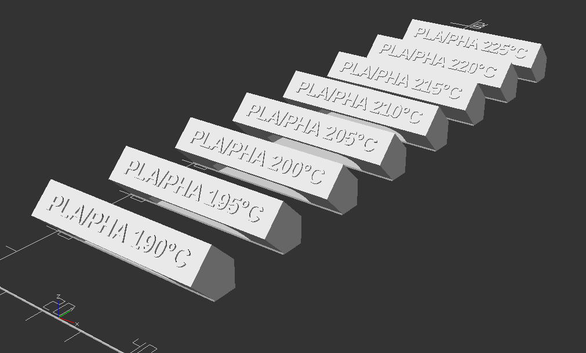

# CR-30 Calibration Shapes

The
[3D Print Mill](https://www.kickstarter.com/projects/3dprintmill/creality-infinite-z-axis-build-volume-printer-3dprintmill)
has an amazing feature which is an infinite Z axis. That's great because you can
print very long objects in one go, but with great powers come great problems. A
lot of things done by the community expect that your nozzle won't be printing at
45° and this includes calibration towers.

This package helps you generate calibration shapes that are appropriate for the
CR-30 and still let you use existing g-code modifying tools to change the
settings during the print, like what is demonstrated in
[CHEP's video](https://www.youtube.com/watch?v=6LjbCIGCmd0).

Here are the appropriate shapes for each setting:

-   **Temperature** &mdash; Use the
    [temperature bridges](./src/temp-bridges.scad)
-   **Fan Speed** &mdash; Also works with
    [temperature bridges](./src/temp-bridges.scad)
-   **Retraction distance** &mdash; Not available
-   **Retraction speed** &mdash; Not available

## Printing

This is made using [OpenSCAD](https://openscad.org/), you'll need it to generate
the STL files from the source code. It especially doesn't make sense to provide
STL files since the goal is to get shapes that are matching what you are going
to print.

### Temperature Bridges

That's the equivalent of traditional temperature towers (with the same shape
basically), except that instead of being stacked up the bridges are put one
after the other on the Z-axis (which is infinite).

#### Print procedure

In order to print a series of bridges, the steps are:

1. Customize the [`temp-bridges.scad`](src/temp-bridges.scad) file to fit your
   needs
2. Generate the STL file (you can use OpenSCAD's GUI or use the CLI
   `make temp-bridges`)
3. Slice the models making sure of your settings (mostly the layer height)
4. Modify the gcode, using [Cura plugins](https://youtu.be/6LjbCIGCmd0?t=174) by
   example
5. Profit (well, print)

#### Settings

Specifically, here is what settings categories do. For individual settings,
please refer to the comments in the code.

-   **Print Settings** &mdash; Overall settings about the way this is going to
    be printed
-   **Tested Value** &mdash; The goal of this calibration shape is to find out
    which value of a setting is the best. This value will be printed on the part
    to make it easier to recognize after the printing. This section lets you
    define what values you want to test.
-   **Printed Text** &mdash; On top of printing the tested value, the top of the
    bridge contains inscriptions that can be by example the name or brand of the
    material you're printing. For example on the screenshot you can see "PLA/PHA
    190°C" which allows me to remember that I was printing PLA/PHA from
    ColorFabb and then to know at which temperature it was extruded. The format
    is `{prefix}{value}{suffix}`.
-   **Bridge Dimensions** &mdash; If you want to alter some dimensions of bridge
    components. All dimensions are given in layers count so that you can get a
    good idea of what you're doing as well as making sure that the generated
    shape rounds-up well when sliced, especially on smaller details.
